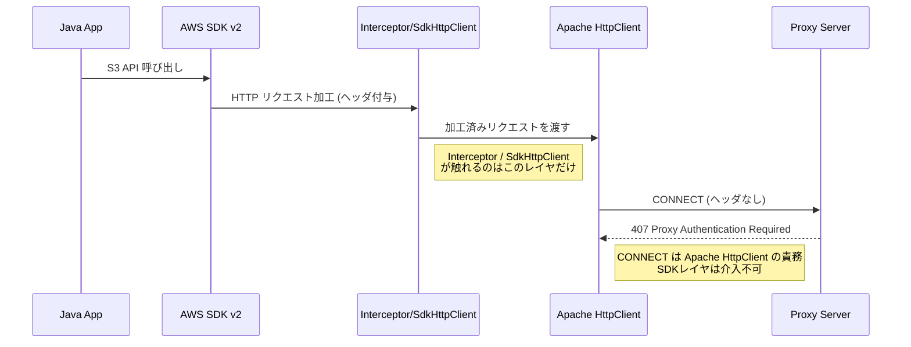

## はじめに
本記事では、AWS SDK v2 for Java を使って Bearer 認証つき Proxy を経由し、AWS API を呼び出す方法について解説します。

結論から言うと、  
AWS SDK v2 のデフォルト構成では Bearer 認証つき Proxy をそのまま通すことはできません。

その理由は「どのレイヤで認証が行われるのか」にあります。  
この記事では、実際に試した失敗例を整理しながら  

- どこに Bearer 認証を入れればよいのか  
- なぜ SDK のカスタマイズでは解決しないのか  
- Apache5 を使うことでなぜ解決するのか  

を解説していきます。

## AWS SDK v2 のProxy設定を確認

AWS SDK v2 for Java の公式ドキュメントでは、次のように Proxy 設定が紹介されています。

> [HTTP プロキシの設定（コードでの設定）](https://docs.aws.amazon.com/ja_jp/sdk-for-java/latest/developer-guide/http-config-proxy-support.html#http-config-proxy-support-in-code) より
```java
SdkHttpClient httpClient1 = ApacheHttpClient.builder()
    .proxyConfiguration(ProxyConfiguration.builder()
        .endpoint(URI.create("http://proxy.example.com"))
        .username("username")
        .password("password")
        .addNonProxyHost("localhost")
        .build())
    .build();

S3Client s3Client = S3Client.builder()
    .httpClient(httpClient)
    .build();
```    

[公式資料](https://docs.aws.amazon.com/ja_jp/sdk-for-java/latest/developer-guide/http-config-proxy-support.html#http-config-proxy-support-external)(2025/12/24 時点)では、AWS SDK v2 は `ProxyConfiguration` を通じて Proxy の `endpoint`, `username`, `password` を指定可能ですが，公式ドキュメントではBasic 認証以外の Proxy 認証方式は明記されていませんでした。

## 自力でヘッダー付与

Proxy が Bearer 認証を要求する場合、下記のようなヘッダーが必要となります。

```bash
Proxy-Authorization: Bearer <token>
```

そこで、AWS SDK 内の処理をフックしてヘッダーを付与する方法を2種類試してみました。

### 案1: Interceptor を利用しヘッダー付与  
ExecutionInterceptorを用いて、SDK が送る HTTP リクエストにヘッダーを追加する方法を試しました。
```java
public class RequestInterceptor implements ExecutionInterceptor {
  @Override
  public SdkHttpRequest modifyHttpRequest(
      Context.ModifyHttpRequest context, ExecutionAttributes executionAttributes) {

    return context.httpRequest().toBuilder()
        .putHeader("Proxy-Authorization", StandardAuthScheme.BEARER + " " + "test-token")
        .build();
  }
}
```

### 案2: SdkHttpClientをラップしてヘッダー付与
SdkHttpClient をラップし、SDK で実行されるすべての HTTP リクエストにヘッダーを追加する方法を試しました。

```java
public class ProxyHeaderHttpClient implements SdkHttpClient {
  private final SdkHttpClient sdkHttpClient;

  public ProxyHeaderHttpClient(SdkHttpClient sdkHttpClient) {
    this.sdkHttpClient = sdkHttpClient;
  }

  @Override
  public ExecutableHttpRequest prepareRequest(HttpExecuteRequest request) {
    final var newRequestBuilder = request.httpRequest().toBuilder();
    newRequestBuilder.putHeader(
        "Proxy-Authorization", StandardAuthScheme.BEARER + " " + "test-token");

    final var newRequest =
        HttpExecuteRequest.builder()
            .request(newRequestBuilder.build())
            .contentStreamProvider(request.contentStreamProvider().orElse(null))
            .build();

    return sdkHttpClient.prepareRequest(newRequest);
  }

  @Override
  public void close() {
    sdkHttpClient.close();
  }
}
```

### 結果：どちらも Bearer 認証は失敗

理由は、Proxy 認証は “アプリケーション層のリクエスト” ではなく、“CONNECT （トランスポート層）” で処理されるためでした。

Interceptor / SdkHttpClient が触れるのは “アプリケーション層の HTTP リクエスト”のためCONNECTに対してヘッダーを付与することはできません。

図で表すと次のようになります。



まとめると、

- Interceptor が触れるのは アプリケーション層（S3 API の HTTP リクエスト）
- Proxy 認証が行われるのは CONNECT（トランスポート層）
- CONNECT は Apache HttpClient（Transport 層）の処理
- AWS SDK は CONNECT を加工する API を提供していない

そのため、どれだけ Interceptor や SdkHttpClient を工夫しても
CONNECT に Bearer 認証ヘッダーを付与することはできない
という構造的な限界があります。

## Proxy 認証の本質：CONNECT とチャレンジレスポンス

ここまでの失敗理由を踏まえ、そもそも Proxy 認証（特に HTTPS での通信）がどのように行われるのかを整理します。

HTTPS + Proxy の場合、通信は次のように進みます。

1. クライアントは次のような **CONNECT** リクエストを Proxy に送ってトンネルを確立する。
```bash
CONNECT s3.ap-northeast-1.amazonaws.com:443 HTTP/1.1
```

2. Proxy がBearer認証を要求している場合は、次のように 407 を返却する。
```bash
HTTP/1.1 407 Proxy Authentication Required
Proxy-Authenticate: Bearer realm="proxy"
```

3. クライアントはこの “チャレンジ” に応じて、**Bearer ヘッダーを付与した CONNECT を再送**する。

```bash
CONNECT ...
Proxy-Authorization: Bearer <token>
```

3. 認証が成功すると、Proxy はトンネルを開放し、CONNECT完了
```bash
HTTP/1.1 200 Connection established
````

4. TLS ハンドシェイクが始まり、初めて S3 への通常 HTTP リクエストが送られます。


次のようなイメージです。

```mermaid
sequenceDiagram
    participant Client as Java Client
    participant Proxy as Proxy Server
    participant AWS as AWS Endpoint (S3)

    Client->>Proxy: CONNECT s3.amazonaws.com:443
    Proxy-->>Client: 407 Proxy Authentication Required<br/>Proxy-Authenticate: Bearer realm="proxy"

    Note right of Client: Bearer 認証を要求されたため<br>トークンを付与して再送する必要がある

    Client->>Proxy: CONNECT + Proxy-Authorization: Bearer <token>
    Proxy-->>Client: 200 Connection established

    Note right of Proxy: トンネル確立完了<br>ここから TLS ハンドシェイク

    Client->>AWS: GET /object (inside TLS)
    AWS-->>Client: 200 OK
````

ポイントは次の2つです。

1. Proxy 認証は CONNECT（TCP トンネル確立）のフェーズで行われる  
2. CONNECT は Apache HttpClient の内部処理であり、Interceptor や SdkHttpClient が触れる HTTP リクエストとは別物

つまり、“アプリケーション層の HTTP リクエストに Bearer を付けても意味がない”  という構造になっており、Bearer 認証を実現するには HttpClient 側に実装しなければいけません。

## Apache4（HttpClient 4.x）では Bearer 認証は失敗する

AWS SDK v2 のデフォルト HTTP クライアントは Apache HTTP Client 4.x（以下 Apache4）です。
しかし Apache4 にはBearer 認証の実装がありません。

https://github.com/apache/httpcomponents-client/blob/4.5.x/httpclient/src/main/java/org/apache/http/impl/client/AuthenticationStrategyImpl.java#L71-L78

これよりApache4では下記のような挙動となります。
HttpClient 本体が Bearer を認識できず永久に 407 のまま失敗します。

1. Proxy から 407 Proxy Authentication Required を受け取る
2. Bearer スキームを選択できない
3. CONNECT を再送できない


## Apache5（HttpClient 5.x）なら Bearer 認証が可能
次に Apache5（HttpClient5）を見ると、Bearer 認証が正式にサポートされていることが確認できます。

https://github.com/apache/httpcomponents-client/blob/d07c8e26cbe69cc94e1b98ba8b5fdfb284244b6a/httpclient5/src/main/java/org/apache/hc/client5/http/impl/DefaultAuthenticationStrategy.java#L69-L74

これよりApache5では下記のような挙動となり、Bearer認証を正しく処理できます。

1. Proxy から 407 Proxy Authentication Required を受け取る
2. Bearer スキームを選択
3. Bearer ヘッダーを生成
4. CONNECT を再送
5. 認証成功 → トンネル確立

AWS SDK v2 では、Apache5 ベースのクライアントが preview として利用できます。

[Preview Release of the AWS SDK Java 2.x HTTP Client built on Apache HttpClient 5.5.x](https://aws.amazon.com/jp/blogs/developer/preview-release-of-theaws-sdk-java-2-x-http-client-built-on-apache-httpclient-5-5-x/)

これを使うことで、AWS SDK v2 で Bearer 認証付き Proxy を通せるようになります。

## Apache5（HttpClient5）を AWS SDK v2 で使う方法

AWS SDK v2 は、Apache5 ベースのクライアントを preview として提供しています。

```gradle
implementation(platform("software.amazon.awssdk:bom:2.40.7"))
implementation("software.amazon.awssdk:s3")
implementation("software.amazon.awssdk:apache5-client")
```

しかし、これだけでは Bearer 認証は動きません。

Apache5 は 認証スキームそのもの（BEARER） を持っていますが、「どの Bearer トークンを使うのか」は利用者が提供する必要があります。

そのために必要なのが：

- [AuthScheme（認証スキームの実体）](https://github.com/apache/httpcomponents-client/blob/d07c8e26cbe69cc94e1b98ba8b5fdfb284244b6a/httpclient5/src/main/java/org/apache/hc/client5/http/auth/AuthScheme.java)

- [AuthSchemeFactory（スキームを生成する Factory）](https://github.com/apache/httpcomponents-client/blob/d07c8e26cbe69cc94e1b98ba8b5fdfb284244b6a/httpclient5/src/main/java/org/apache/hc/client5/http/auth/AuthSchemeFactory.java)

の2つです。

AuthScheme / AuthSchemeFactory の役割は下記のようになっています

- **AuthScheme** : CONNECT の再送時に実際の認証ヘッダー```Proxy-Authorization: Bearer <token>```を生成するためのクラス。

- **AuthSchemeFactory** : Apache5 に「AuthScheme をどう生成するか」を登録するための Factory。

利用したい認証方式ごとに上記のクラスを実装し、Apache5に登録すると次のように動きます

1. Proxy から 407 Proxy Authentication Required を受信
2. 認証スキームレジストリに BEARER があるか確認
3. あれば AuthSchemeFactory からインスタンス生成
4. トークンを使って CONNECT を再送
5. 認証成功 → 200 Connection established

### 実際の S3Client設定例
参考までに実装は下記のようなイメージです。

#### BearerAuthScheme
このクラスは、Proxy からのチャレンジを受けて Bearer トークンを付与するための認証処理を担当します。 
```java
package com.example.aws_proxy_bearer_s3_demo_v3.auth;

import org.apache.hc.client5.http.auth.*;
import org.apache.hc.core5.http.HttpHost;
import org.apache.hc.core5.http.HttpRequest;
import org.apache.hc.core5.http.protocol.HttpContext;

import java.security.Principal;

public class BearerAuthScheme implements AuthScheme {

    private final String token;

    public BearerAuthScheme(String token) {
        this.token = token;
    }

    public String getName() {
        return StandardAuthScheme.BEARER;
    }
    ;

    public boolean isConnectionBased() {
        return false;
    }
    ;

    public void processChallenge(AuthChallenge authChallenge, HttpContext context)
            throws MalformedChallengeException {}
    ;

    public boolean isChallengeComplete() {
        return false;
    }
    ;

    public String getRealm() {
        return null;
    }
    ;

    public boolean isResponseReady(
            HttpHost host, CredentialsProvider credentialsProvider, HttpContext context)
            throws AuthenticationException {
        return true;
    }
    ;

    public Principal getPrincipal() {
        return null;
    }
    ;

    public String generateAuthResponse(HttpHost host, HttpRequest request, HttpContext context)
            throws AuthenticationException {
        return StandardAuthScheme.BEARER + " " + token;
    }
    ;
}
```
### BearerAuthSchemeFactory
Apache5 に登録するための Factory です。
SDK は「認証スキームの生成」を Factory から行うため、このクラスが必須となります。

```java
package com.example.aws_proxy_bearer_s3_demo_v3.auth;

import org.apache.hc.client5.http.auth.AuthScheme;
import org.apache.hc.client5.http.auth.AuthSchemeFactory;
import org.apache.hc.core5.http.protocol.HttpContext;

public class BearerAuthSchemeFactory implements AuthSchemeFactory {
    private final String token;

    public BearerAuthSchemeFactory(String token) {
        this.token = token; 
    }

    @Override
    public AuthScheme create(HttpContext context) {
        // tokenなど、生成処理を本来であれば実装
        // 現在はダミートークンを設定しているのみ
        return new BearerAuthScheme(token); 
    }
}

```

#### Apache5HttpClient にスキームを登録して S3Client を組み立てる

```java
package com.example.aws_proxy_bearer_s3_demo_v3.config;

import com.example.aws_proxy_bearer_s3_demo_v3.auth.BearerAuthSchemeFactory;
import com.example.aws_proxy_bearer_s3_demo_v3.config.properties.AwsS3Properties;
import com.example.aws_proxy_bearer_s3_demo_v3.config.properties.ProxyProperties;
import org.apache.hc.client5.http.auth.AuthSchemeFactory;
import org.apache.hc.client5.http.auth.StandardAuthScheme;
import org.apache.hc.core5.http.config.RegistryBuilder;
import org.springframework.boot.context.properties.EnableConfigurationProperties;
import org.springframework.context.annotation.Bean;
import org.springframework.context.annotation.Configuration;
import software.amazon.awssdk.auth.credentials.AnonymousCredentialsProvider;
import software.amazon.awssdk.core.client.config.ClientOverrideConfiguration;
import software.amazon.awssdk.core.retry.RetryMode;
import software.amazon.awssdk.http.apache5.Apache5HttpClient;
import software.amazon.awssdk.http.apache5.ProxyConfiguration;
import software.amazon.awssdk.services.s3.S3Client;

import javax.net.ssl.TrustManager;
import javax.net.ssl.X509TrustManager;
import java.net.URI;
import java.security.cert.X509Certificate;
import java.time.Duration;

@Configuration
@EnableConfigurationProperties({AwsS3Properties.class, ProxyProperties.class})
public class S3Config {

  @Bean
  public S3Client s3Client(AwsS3Properties s3Props, ProxyProperties proxyProps) {
    final var proxy =
            ProxyConfiguration.builder().endpoint(URI.create(proxyProps.url())).build();

     final var authSchemeRegistryLookup =
             RegistryBuilder.<AuthSchemeFactory>create()
                     .register(
                             StandardAuthScheme.BEARER,
                             new BearerAuthSchemeFactory(proxyProps.bearerToken()))
                     .build();

    final var apache5HttpClient =
            Apache5HttpClient.builder()
                    .proxyConfiguration(proxy)
                    .authSchemeRegistry(authSchemeRegistryLookup)
                    .connectionTimeout(Duration.ofSeconds(5))
                    .socketTimeout(Duration.ofSeconds(5))
                    .tlsTrustManagersProvider(() -> new TrustManager[] {
                            new X509TrustManager() {
                              @Override
                              public X509Certificate[] getAcceptedIssuers() {
                                return new X509Certificate[0];
                              }
                              @Override
                              public void checkClientTrusted(X509Certificate[] certs, String authType) {}
                              @Override
                              public void checkServerTrusted(X509Certificate[] certs, String authType) {}
                            }
                    })
                    .build();

    final var overrideConfig =
            ClientOverrideConfiguration.builder()
                    .apiCallAttemptTimeout(Duration.ofSeconds(30))
                    .apiCallAttemptTimeout(Duration.ofSeconds(30))
                    .retryStrategy(RetryMode.STANDARD)
                    .build();

    return S3Client.builder()
            .httpClient(apache5HttpClient)
            .credentialsProvider(AnonymousCredentialsProvider.create())
            .region(s3Props.region())
            .overrideConfiguration(overrideConfig)
            .build();
  }
}
```

### この設定が担う役割

* `ProxyConfiguration`
  → Proxy の endpoint を設定（Bearer はここでは設定しない）

* `authSchemeRegistry`
  → Bearer 認証スキームを Apache5 に登録
  → **407 応答を受けた時、Bearer を使用して CONNECT を再送可能にする**

* `Apache5HttpClient`
  → CONNECT を含むトランスポート層の処理を担う
  → ここで初めて Bearer が機能する

* `S3Client.builder().httpClient(apache5)`
  → Apache5 が CONNECT を処理し、SDK がアプリケーション層を処理する流れを構築


## まとめ

* Proxy Bearer 認証は **CONNECT（トランスポート層）** で行われる
* Interceptor/SdkHttpClient は **アプリケーション層**しか加工できない
* AWS SDK v2 は Bearer 認証を標準サポートしていない
* Apache4 に Bearer 認証スキームは存在しない
* Apache5 では Bearer 認証が正式サポート（チャレンジレスポンス対応）
* Apache5 + AuthSchemeFactory を使えば Bearer Proxy 認証が可能になる

Apache5 を使うことで、Bearer 認証付き Proxy 経由での S3 リクエストが可能になります。

## 参考文献（公式・一次情報）

* AWS SDK for Java — Proxy 設定
  [https://docs.aws.amazon.com/ja_jp/sdk-for-java/latest/developer-guide/http-config-proxy-support.html](https://docs.aws.amazon.com/ja_jp/sdk-for-java/latest/developer-guide/http-config-proxy-support.html)
* AWS SDK v2 — Apache5 HttpClient（preview）
  [https://sdk.amazonaws.com/java/api/latest/software/amazon/awssdk/http/apache5/Apache5HttpClient.Builder.html](https://sdk.amazonaws.com/java/api/latest/software/amazon/awssdk/http/apache5/Apache5HttpClient.Builder.html)

* Apache HttpClient4 — 認証スキーム
  [https://github.com/apache/httpcomponents-client/blob/4.5.x/httpclient/src/main/java/org/apache/http/impl/client/AuthenticationStrategyImpl.java](https://github.com/apache/httpcomponents-client/blob/4.5.x/httpclient/src/main/java/org/apache/http/impl/client/AuthenticationStrategyImpl.java)
* Apache HttpClient5 — 認証スキーム
  [https://github.com/apache/httpcomponents-client/blob/d07c8e26cbe69cc94e1b98ba8b5fdfb284244b6a/httpclient5/src/main/java/org/apache/hc/client5/http/impl/DefaultAuthenticationStrategy.java](https://github.com/apache/httpcomponents-client/blob/d07c8e26cbe69cc94e1b98ba8b5fdfb284244b6a/httpclient5/src/main/java/org/apache/hc/client5/http/impl/DefaultAuthenticationStrategy.java)
* AuthScheme インタフェース
  [https://github.com/apache/httpcomponents-client/blob/master/httpclient5/src/main/java/org/apache/hc/client5/http/auth/AuthScheme.java](https://github.com/apache/httpcomponents-client/blob/master/httpclient5/src/main/java/org/apache/hc/client5/http/auth/AuthScheme.java)
* AuthSchemeFactory
  [https://github.com/apache/httpcomponents-client/blob/master/httpclient5/src/main/java/org/apache/hc/client5/http/auth/AuthSchemeFactory.java](https://github.com/apache/httpcomponents-client/blob/master/httpclient5/src/main/java/org/apache/hc/client5/http/auth/AuthSchemeFactory.java)
