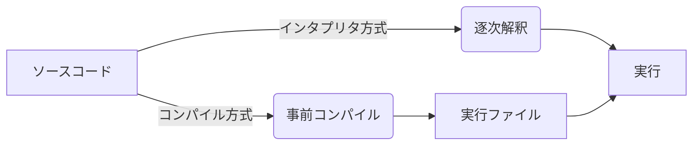
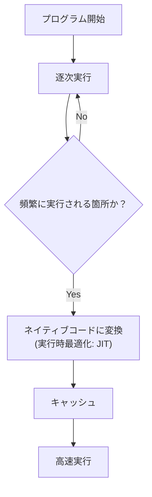

# はじめに
プログラミング言語には、代表的な実行方式として **インタプリタ方式** と **コンパイル方式** が存在します。

本記事では次の3つについて、図解を用いて整理します。

- インタプリタ方式とは何か
- コンパイル方式との違い
- 多くのランタイムが取り入れている JIT（Just-In-Time）最適化とは何か

---

# インタプリタ方式（Interpreter）

**インタプリタ（Interpreter）**  
語源：*interpret*（解釈する） → *interpreter*（通訳者）

通訳者が「声を聴き、意味を理解し、その場で話す」ように、  
プログラムのソースコードを **読み取り → 解釈 → 即時実行** する方式です。

## 処理フロー
```mermaid
sequenceDiagram
    participant Dev as 開発者
    participant Interpreter as インタプリタ
    participant CPU as CPU

    Dev->>Interpreter: ソースコードを渡す
    loop 逐次処理
        Interpreter->>Interpreter: 読み取り
        Interpreter->>Interpreter: 解釈
        Interpreter->>CPU: 命令を実行
    end
    Interpreter-->>Dev: 出力
````

---

# コンパイル方式（Compiler）

**コンパイル（compile）**
語源：*compile*（編集する・まとめる） → *compiler*（編集者）

編集者が「原稿をすべて読み込み、誤りを正し、本としてまとめて出版する」ように、
プログラム全体を **事前に機械語（ネイティブコード）へと変換** してから実行する方式です。

## 処理フロー

```mermaid
flowchart TD
    A[ソースコード] --> B[コンパイラ]
    B --> C[機械語バイナリ / 実行ファイル]
    C --> D[CPUで実行]
```

---

# インタプリタ方式 vs コンパイル方式



| 項目      | インタプリタ方式             | コンパイル方式       |
| ------- | -------------------- | ------------- |
| 実行タイミング | 実行時に解釈               | 実行前に変換        |
| 特徴      | 柔軟・対話的               | 性能最適化しやすい     |
| 代表例     | Python / Ruby / JS   | C / Rust / Go |
| 備考      | 実処理は VM/JIT を含むことが多い | バイナリ単体で実行可能   |

※ 各言語の実装は多様であり、明確に二分できない場合があります。

---

# JIT 最適化（Just-in-Time）

**JIT（Just-in-Time）**
語源：*just in time*（必要な時にちょうど）

実行中に **頻繁に使われる箇所だけ** をネイティブコードに最適化する方式です。
インタプリタ・コンパイル方式のいずれとも異なる、**実行時最適化** と呼ばれるアプローチです。

## 処理フロー



## JIT を採用する代表的なランタイム

（環境ごとに内部実装は異なるものの、代表例として知られています）

* Java Virtual Machine（HotSpot / GraalVM）
* .NET CLR / CoreCLR
* JavaScript エンジン（V8 / SpiderMonkey）
* Ruby（YJIT / MJIT）
* Python（PyPy）

---

# まとめ

**インタプリタ（Interpreter）**

* 語源：通訳者
* 読みながら逐次実行する方式

**コンパイル（Compiler）**

* 語源：編集者
* 実行前にまとめて機械語へ変換する方式

**JIT（Just-in-Time）**

* 語源：必要なときにちょうど
* 実行中に特定部分だけを最適化して高速化する技術

現代の言語処理系は、これらを単独で用いるのではなく、
次のような複数の技術を **組み合わせたハイブリッド型** が主流です。

* インタプリタ的処理
* バイトコードを VM で実行
* 事前コンパイル（AOT）
* 実行時最適化（JIT）
* トランスパイル
* 中間表現（IR）を利用した最適化

「適材適所で複数の方式を組み合わせる」ことが、現代的な実行基盤の特徴です。

---

# 参考文献

* **MDN Web Docs（JavaScript）**
  [https://developer.mozilla.org/ja/docs/Web/JavaScript](https://developer.mozilla.org/ja/docs/Web/JavaScript)
* **Oracle Java Documentation（JVM / JIT）**
  [https://docs.oracle.com/cd/F32587_01/jjdev/Oracle-JVM-JIT.html](https://docs.oracle.com/cd/F32587_01/jjdev/Oracle-JVM-JIT.html)
* **Microsoft .NET Documentation**
  [https://learn.microsoft.com/dotnet/](https://learn.microsoft.com/dotnet/)
* **Ruby公式ドキュメント（YJIT / MJIT）**
  [https://docs.ruby-lang.org/ja/](https://docs.ruby-lang.org/ja/)
* **Python公式（CPython / バイトコード）**
  [https://docs.python.org/ja/3/](https://docs.python.org/ja/3/)
* **PyPy公式（JIT）**
  [https://www.pypy.org/](https://www.pypy.org/)
