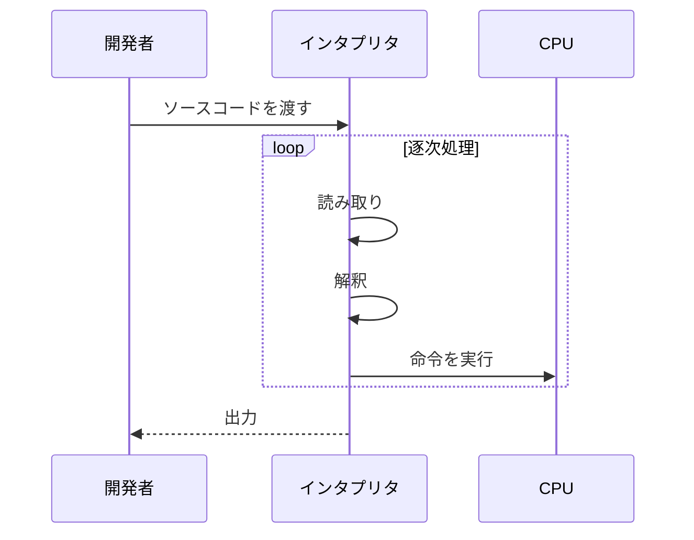
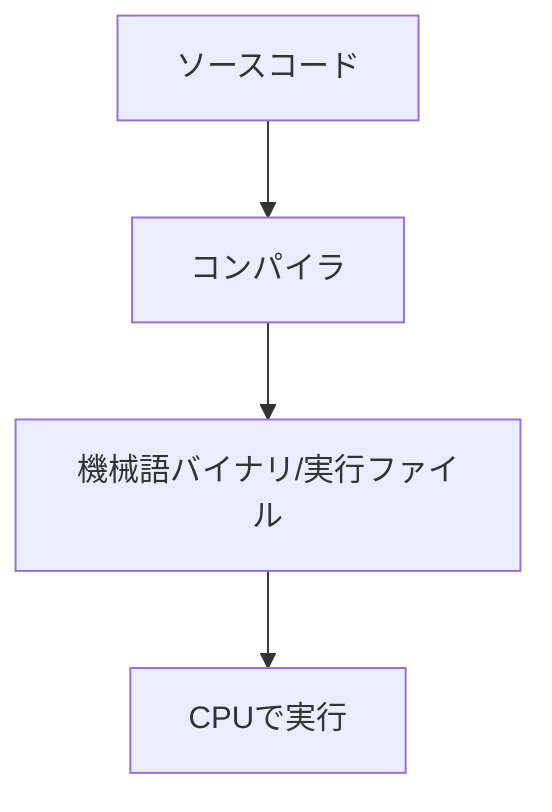
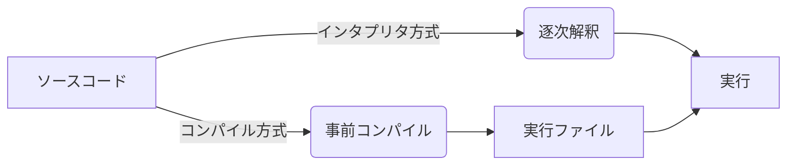
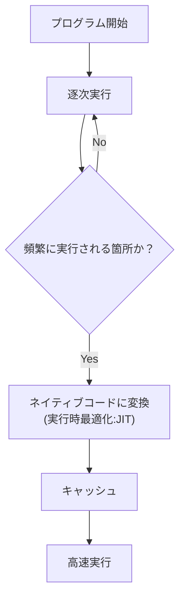

# はじめに
プログラミング言語にはインタプリタ方式・コンパイル方式などの代表的な方式があります。

この記事では

- インタプリタ方式とは何か
- コンパイル方式との違い
- 多くのランタイムで採用される JIT (Just-In-Time)最適化

をMermaid図をもちいて整理します

# インタプリタ方式

インタプリタ (Interpreter) 
語源： 解釈する (interpret) → 通訳者 (interpreter)

通訳者が「声を聴き、意味を理解し、その場で話す」ように、
プログラムのソースコードを下記の流れで逐次実行する方式です。

1. 読み取り
2. 解釈 
3. 即時実行

## 処理フロー 

# コンパイル方式

コンパイル (compile)
語源: 編集する・まとめる (compile) →  編集者 (compiler)

編集者が「原稿をすべて読み込み、誤りを正し、最終的に本の形へまとめて出版する」ように、
プログラム全体を一度まとめて機械語（本番の形）へ変換してから実行する方式。

## 処理フロー

# インタプリタ方式 vs コンパイル方式

| 項目      | インタプリタ方式           | コンパイル方式      |
| ------- | ------------------ | ------------ |
| 実行タイミング | 実行時に解釈             | 実行前に変換       |
| 特徴      | 柔軟・対話的             | 性能最適化しやすい    |
| 代表的な開発言語       | Python, Ruby, JS   | C, Rust, Go  |
| 備考      | 実処理はVM/JITを含む場合が多い | 実行はバイナリ単体で可能 |

* 各言語の実装は多様なので、明確に二分できない場合があります。

# JIT最適化

JIT (Just-in-Time)
語源: 必要な時にちょうど (just in time)

実行時に必要な箇所だけを最適化して機械語(ネイティブコード)にする技術

インタプリタや、コンパイラという分類ではなく第三のアプローチ(実行時最適化)となっている。

## 処理フロー

## JITを採用する代表的なランタイム

- Java Virtual Machine (HotSpot / GraalVM)
- .NET CLR / CoreCLR
- JavaScript エンジン (V8/SpiderMonkey)
- Ruby (YJIT/MJIT)
- Python (PyPy)

* 代表的な例としてしられるものであり、内部実装は環境ごとに異なります。

# まとめ

* **インタプリタ**

  * 語源：通訳者
  * 「読んで理解しながら実行」する方式
* **コンパイル**

  * 語源：編集者
  * 実行前に機械語へ変換する方式
* **JIT**

  * 語源: 必要な時にちょうど
  * 必要部分だけ実行時に最適化
  * 主要なランタイムで利用される一般的な技術

この記事では、インタプリタ方式、コンパイル方式、JIT の基礎を整理しました。

そして、現代の言語処理系はこれらを単独ではなく、目的に応じて組み合わせたハイブリッド方式が主流です。

多くのランタイムは、次のような技術を併用して実行を最適化します。

- インタプリタ的処理
- VMにおけるバイトコード実行
- AOTコンパイル
- JIT最適化
- トランスパイル
- 中間表現(IR)による実行

このように“複数の技術を適材適所で組み合わせる”ことこそ、現代の実行基盤の特徴です。

# 参考文献:

* **MDN Web Docs（JavaScript）**
  https://developer.mozilla.org/ja/docs/Web/JavaScript

* **Oracle Java Documentation（JVM / JIT）**
  https://docs.oracle.com/cd/F32587_01/jjdev/Oracle-JVM-JIT.html

* **Microsoft .NET Documentation**
  https://learn.microsoft.com/dotnet/

* **Ruby公式ドキュメント（YJIT / MJIT）**
  https://docs.ruby-lang.org/ja/

* **Python公式ドキュメント（CPython / バイトコード）**
  https://docs.python.org/ja/3/

* **PyPy公式（JIT）**
  https://www.pypy.org/
